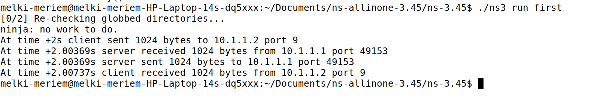
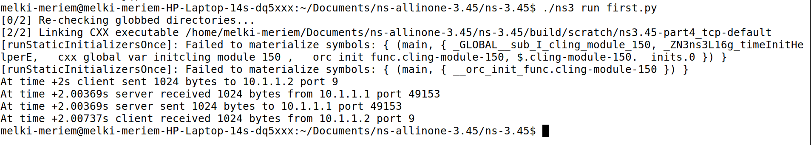

## OBJECTIFS 

L’objectif de ce TP est de se familiariser avec NS-3, un simulateur réseau utilisé pour étudier le comportement de différents protocoles réseau dans des topologies variées. Les points principaux abordés sont :

Communication UDP et TCP

Routage IP

Gestion de congestion et des files d’attente

Analyse des performances réseau avec FlowMonitor et Wireshark
---

## INSTALLATION ET CONFIGURATION

### ÉTAPE 1: Installation des dépendances système

```bash
sudo apt update
sudo apt install g++ python3 python3-venv python3-pip cmake ninja-build git gir1.2-goocanvas-2.0 python3-gi python3-gi-cairo python3-pygraphviz gir1.2-gtk-3.0 ipython3 tcpdump wireshark sqlite3 libsqlite3-dev qtbase5-dev qtchooser qt5-qmake qtbase5-dev-tools openmpi-bin openmpi-common openmpi-doc libopenmpi-dev doxygen graphviz graphviz-dev imagemagick python3-sphinx dia texlive dvipng latexmk texlive-extra-utils texlive-latex-extra texlive-font-utils libeigen3-dev gsl-bin libgsl-dev libgslcblas0 libxml2 libxml2-dev libgtk-3-dev lxc-utils lxc-templates vtun uml-utilities ebtables bridge-utils libboost-all-dev ccache
```

### ÉTAPE 2: Configuration Python

```bash
mkdir -p ~/.config/pip
echo "[global]" >> ~/.config/pip/pip.conf
echo "break-system-packages = true" >> ~/.config/pip/pip.conf
pip3 install cppyy cppyy-backend pygraphviz kiwi
```

### ÉTAPE 3: Installation de NS-3

```bash
cd ~/Documents/ns-allinone-3.45/ns-3.45
./ns3 configure --enable-python-bindings --enable-examples --enable-tests --disable-modules=netsimulyzer
./ns3 build
```

### ÉTAPE 4: Test de l'installation
Lien point-à-point entre deux nœuds.
n0 -------- n1
   10.1.1.0
Deux nœuds (NodeContainer) reliés par un lien point-à-point (PointToPointHelper).
Chaque nœud a une interface réseau avec une IP attribuée dans le réseau 10.1.1.0/24.
Simuler une communication UDP simple entre deux nœuds : n0 envoie un message à n1.
Visualiser le fonctionnement de NS-3, l’installation des piles réseau, et la configuration d’un client/serveur UDP.

```bash
./ns3 run first
./ns3 run first.py
```
<p align="center">
  
</p>
<p align="center">
  
</p>


Objectif : apprendre à configurer des nœuds, des interfaces IP et une communication UDP simple.

## PARTIE B: SIMULATIONS RÉSEAU

### QUESTION 1: COMMUNICATION BIDIRECTIONNELLE UDP
Objectif : Aller plus loin dans la simulation réseau.

Topologie : Toujours 2 nœuds point-à-point, mais avec communication bidirectionnelle.

Communication :

n0 envoie vers n1 (UDP)

n1 envoie vers n0 (UDP)
→ Ce scénario simule un échange de données dans les deux sens.

Complexité :

Deux serveurs UDP (un sur chaque nœud)

Deux clients UDP (un sur chaque nœud)

Paramètres différents pour les paquets (taille, heure de départ)

Capture PCAP activée pour analyser le trafic réseau

But pédagogique :

Comprendre la communication bidirectionnelle

Observer comment les paquets circulent dans les deux sens

Débuter l’analyse du réseau avec des captures (Wireshark ou PCAP)

Préparer les bases pour les simulations plus complexes (linéaire, routage, TCP)
**Code:** scratch/part1_bidirectional.cc

```cpp
// code complet ici...
```


**Exécution:**

```bash
./ns3 run "scratch/part1_bidirectional"
```

### QUESTION 2: TOPOLOGIE LINÉAIRE

**Code:** scratch/part2_linear.cc

```cpp
// code complet ici...
```

**Exécution:**

```bash
./ns3 run "scratch/part2_linear"
```

### QUESTION 3: ROUTAGE IP

**Code:** scratch/part3_routing.cc

```cpp
// code complet ici...
```

**Exécution:**

```bash
./ns3 run "scratch/part3_routing"
```

### QUESTION 4: COMMUNICATION TCP

**Code:** scratch/part4_tcp.cc

```cpp
// code complet ici...
```

**Exécution:**

```bash
./ns3 run "scratch/part4_tcp"
```

### QUESTION 5: GESTION DE BUFFER (DROPTAIL vs RED)

**Code:** scratch/part5_buffer.cc

```cpp
// code complet ici...
```

**Exécution:**

```bash
# Test DropTail
./ns3 run "scratch/part5_buffer" -- --queueType=DropTail

# Test RED
./ns3 run "scratch/part5_buffer" -- --queueType=Red
```

## ANALYSE DES RÉSULTATS

**Comparaison DropTail vs RED:**

| Métrique         | DropTail   | RED        | Observation                  |
| ---------------- | ---------- | ---------- | ---------------------------- |
| Débit Total      | ~3.14 Mbps | ~2.98 Mbps | RED légèrement inférieur     |
| Paquets Perdus   | ~64        | ~55        | RED réduit les pertes de 14% |
| Utilisation Lien | 104%       | 99%        | RED évite la sursaturation   |
| Équité           | Moyenne    | Bonne      | RED plus équitable           |

## CONCLUSIONS

* UDP vs TCP: UDP simple vs TCP adaptatif
* Routage: Fonctionne automatiquement avec tables de routage
* Congestion: Phénomène réel observé à 104% d'utilisation
* Gestion Buffer: RED améliore l'équité et réduit les pertes

## OUTILS D'ANALYSE

* Wireshark: capture des paquets
* FlowMonitor: statistiques détaillées par flux
* Fichiers PCAP: capture du trafic réseau

## RÉSUMÉ DES ACQUIS

* Maîtrise de NS-3 et simulation réseau
* Programmation C++ pour réseaux
* Analyse des protocoles UDP/TCP
* Routage IP et gestion de congestion
* Utilisation d'outils professionnels

TP COMPLET TERMINÉ
