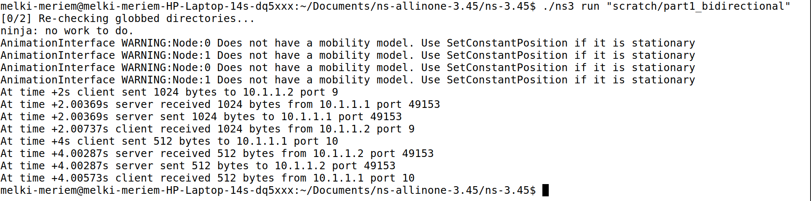

# TP COMPLET - PROTOCOLES RÉSEAUX MOBILES

## Informations générales

* **Université**: Université de Carthage - INSAT
* **Niveau**: RT4
* **Enseignante**: Dr Mériem Afif
* **Année**: 2025/2026
* **Sujet**: Simulation réseau avec NS-3

---

## Objectifs du TP

* Installer et configurer l'environnement NS-3
* Comprendre et simuler les protocoles UDP et TCP
* Maîtriser le routage IP et la gestion de congestion
* Analyser les performances réseau avec FlowMonitor et Wireshark
* Observer les différences entre les protocoles et les stratégies de gestion de buffer

---

## Installation et configuration

### Installation des dépendances système

```bash
sudo apt update
sudo apt install g++ python3 python3-venv python3-pip cmake ninja-build git \
gir1.2-goocanvas-2.0 python3-gi python3-gi-cairo python3-pygraphviz gir1.2-gtk-3.0 \
ipython3 tcpdump wireshark sqlite3 libsqlite3-dev qtbase5-dev qtchooser qt5-qmake \
qtbase5-dev-tools openmpi-bin openmpi-common openmpi-doc libopenmpi-dev doxygen graphviz \
graphviz-dev imagemagick python3-sphinx dia texlive dvipng latexmk texlive-extra-utils \
texlive-latex-extra texlive-font-utils libeigen3-dev gsl-bin libgsl-dev libgslcblas0 \
libxml2 libxml2-dev libgtk-3-dev lxc-utils lxc-templates vtun uml-utilities ebtables \
bridge-utils libboost-all-dev ccache
```

### Configuration Python

```bash
mkdir -p ~/.config/pip
echo "[global]" >> ~/.config/pip/pip.conf
echo "break-system-packages = true" >> ~/.config/pip/pip.conf
pip3 install cppyy cppyy-backend pygraphviz kiwi
```

### Installation de NS-3

```bash
cd ~/Documents/ns-allinone-3.45/ns-3.45
./ns3 configure --enable-python-bindings --enable-examples --enable-tests --disable-modules=netsimulyzer
./ns3 build
```

### Test de l'installation

```bash
./ns3 run first
./ns3 run first.py
```

---

## Partie A : Exemple de simulation de base

### first.cc / first.py

#### But

Simuler une communication UDP simple entre deux nœuds reliés par un lien point-à-point.

#### Topologie

```
n0 -------- n1
   10.1.1.0
```

#### Composants principaux

* **NodeContainer**: Crée les nœuds du réseau
* **PointToPointHelper**: Définit le lien avec un débit et un délai spécifique
* **InternetStackHelper**: Installe la pile IP sur les nœuds
* **Ipv4AddressHelper**: Assigne les adresses IP sur le lien
* **UdpEchoServerHelper et UdpEchoClientHelper**: Créent un serveur et un client UDP
* **Simulator**: Gère le temps et l'exécution de la simulation

#### Description

Deux nœuds (NodeContainer) reliés par un lien point-à-point (PointToPointHelper). Chaque nœud a une interface réseau avec une IP attribuée dans le réseau 10.1.1.0/24. Simuler une communication UDP simple entre deux nœuds : n0 envoie un message à n1. Visualiser le fonctionnement de NS-3, l'installation des piles réseau, et la configuration d'un client/serveur UDP.

#### Commande

```bash
./ns3 run "examples/tutorial/first.cc"
./ns3 run "examples/tutorial/first.py"
```




---

## Partie B : Simulations réseau avancées

### 1. Communication bidirectionnelle UDP (part1_bidirectional.cc)

#### But

Échange UDP bidirectionnel entre deux nœuds.

#### Différence avec first.cc

Trafic bidirectionnel, chaque nœud est client et serveur. Simuler une communication UDP bidirectionnelle entre deux nœuds. Contrairement à first.cc qui envoie un seul paquet dans une direction (client → serveur), ici chaque nœud agit à la fois comme serveur et client, permettant l'échange de paquets dans les deux sens.

#### Commande

```bash
./ns3 run "scratch/part1_bidirectional"
```


---

### 2. Topologie linéaire (part2_linear.cc)

#### But

Trois nœuds connectés linéairement pour étudier le passage de paquets via un nœud intermédiaire.

#### Topologie

```
n0 --- n1 --- n2
```

#### Description

Simuler une topologie linéaire de trois nœuds (n0, n1, n2) pour étudier le passage de paquets UDP à travers un nœud intermédiaire. Cela permet de comprendre comment fonctionne le routage IP sur plusieurs liens.

#### Caractéristiques

* **Adresses IP**: Chaque lien a sa propre adresse (ex. 10.1.1.0 pour n0-n1, 10.1.2.0 pour n1-n2)
* **Routage**: Manuel
* **Fonctionnement**: Le code crée explicitement des clients et serveurs UDP sur chaque nœud et indique quelle adresse IP envoyer. Les paquets passent du nœud 0 au nœud 2 via nœud 1, mais c'est le code qui définit exactement les adresses à utiliser.
* **Objectif**: Comprendre la communication linéaire et comment configurer des adresses IP sur chaque lien.

#### Commande

```bash
./ns3 run "scratch/part2_linear"
```


---

### 3. Routage IP (part3_routing.cc)

#### But

Ajouter le routage global IP pour permettre aux paquets de traverser plusieurs nœuds automatiquement.

#### Topologie

```
n0 --- n1 --- n2
```

#### Comparaison avec part2_linear.cc

**part2_linear.cc**

* Topologie : 3 nœuds connectés linéairement
* Adresses IP : chaque lien a sa propre adresse (ex. 10.1.1.0 pour n0-n1, 10.1.2.0 pour n1-n2)
* Routage : manuel
* Le code crée explicitement des clients et serveurs UDP sur chaque nœud et indique quelle adresse IP envoyer
* Les paquets passent du nœud 0 au nœud 2 via nœud 1, mais c'est le code qui définit exactement les adresses à utiliser
* But : comprendre la communication linéaire et comment configurer des adresses IP sur chaque lien

**part3_routing.cc**

* Topologie : la même 3 nœuds linéaires
* Adresses IP : chaque lien a sa propre adresse, comme dans part2
* Routage : automatique
* On utilise Ipv4GlobalRoutingHelper::PopulateRoutingTables();
* NS-3 calcule automatiquement les routes pour chaque nœud
* Le client n'a pas besoin de connaître l'adresse intermédiaire du nœud 1, il envoie simplement au serveur, et les paquets traversent n1 automatiquement
* But : simuler le routage réel d'un réseau avec plusieurs nœuds sans config manuelle pour chaque flux

#### Commande

```bash
./ns3 run "scratch/part3_routing"
```


---

### 4. Communication TCP (part4_tcp.cc)

#### But

Simuler une communication TCP fiable entre deux nœuds et mesurer la performance du protocole (débit, pertes). Contrairement à UDP, TCP est orienté connexion et garantit la livraison des paquets.

#### Commande

```bash
./ns3 run "scratch/part4_tcp"
```


---

### 5. Gestion de buffer (part5_buffer.cc)

#### But

Cette partie du TP vise à comparer deux politiques de gestion de files d'attente dans les routeurs pour gérer la congestion.

#### Politiques de gestion

**DropTail**

La file d'attente classique où les paquets sont simplement rejetés quand la queue est pleine.

**RED (Random Early Detection)**

Une file d'attente intelligente qui commence à supprimer aléatoirement les paquets avant que la queue ne soit pleine pour éviter la congestion et améliorer l'équité entre flux.

#### Commandes

```bash
# Test DropTail
./ns3 run "scratch/part5_buffer" -- --queueType=DropTail


# Test RED
./ns3 run "scratch/part5_buffer" -- --queueType=Red
```


---

## Analyse des résultats

* **UDP vs TCP**: UDP est non fiable, TCP s'adapte à la congestion et garantit la livraison
* **Routage IP**: Les tables de routage permettent aux paquets de traverser plusieurs nœuds automatiquement
* **Congestion et gestion de buffer**: RED améliore l'équité et réduit les pertes comparé à DropTail
* **Outils d'analyse**: Wireshark pour visualiser le trafic, FlowMonitor pour statistiques détaillées

---

## Résumé des acquis

* Maîtrise de NS-3 et simulation réseau
* Programmation C++ pour simulation des réseaux
* Analyse des protocoles UDP et TCP
* Compréhension du routage IP et de la gestion de congestion
* Utilisation d'outils professionnels pour l'analyse réseau (Wireshark, FlowMonitor)
